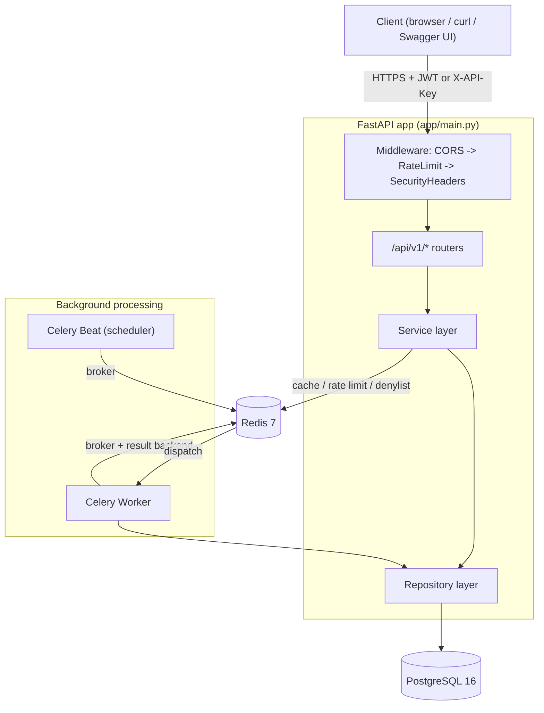
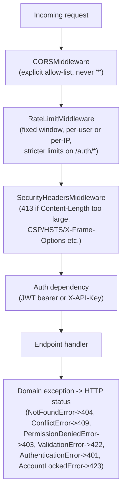

# Architecture

Sentinel is a multi-tenant uptime-monitoring and incident-management API.
This document covers the system topology, the background-job pipeline that
turns a failed health check into a delivered alert, and the request
middleware stack.

## 1. System overview



- **FastAPI app** (`app/main.py`) — the only synchronous entry point.
  Registers three layers of middleware, the versioned API router, a
  exception-to-HTTP-status mapping layer, and a `/health` endpoint.
- **PostgreSQL** — system of record for everything (`app/db`, SQLAlchemy 2.0
  async ORM, Alembic migrations).
- **Redis** — three independent roles: Celery broker/result backend, an
  application cache (`app/services/cache.py`), and security state (rate
  limiting, login-failure counters, JWT access-token denylist). All Redis
  reads/writes catch `RedisError` and degrade gracefully — Sentinel keeps
  serving correct (just less cached/rate-limited) responses if Redis is
  down.
- **Celery Beat + Worker** — Beat enqueues three periodic jobs; Worker
  executes them. In dev/test, `CELERY_TASK_ALWAYS_EAGER=true` runs the same
  task functions synchronously in-process, so the business logic is
  identical with or without a broker.

## 2. Background pipeline: Monitoring -> Incident -> Notification -> Analytics

This is the core value loop of the product — a scheduled probe that can end
with a human getting paged.

```mermaid
graph LR
    Beat["Celery Beat"] -->|"every CHECK_DISPATCH_INTERVAL_SECONDS"| Dispatch["dispatch_due_checks"]
    Dispatch -->|"one task per due monitor"| Perform["perform_check"]

    subgraph ME["Monitoring Engine (app/workers/checkers.py)"]
        Perform --> HTTP["_check_http (GET, <400 = success)"]
        Perform --> TCP["_check_tcp (open_connection)"]
        Perform --> PING["_check_ping (OS ping subprocess)"]
    end

    HTTP --> Record["CheckService.record_check"]
    TCP --> Record
    PING --> Record

    subgraph IE["Incident Engine (app/services/incident.py + check.py)"]
        Record -->|"failure: consecutive_failures++"| Threshold{"consecutive_failures\n>= failure_threshold?"}
        Threshold -->|"yes, no open incident"| OpenInc["open Incident (severity=major)"]
        Record -->|"success: reset counter"| Resolve{"open incident\nexists?"}
        Resolve -->|"yes"| ResolveInc["auto-resolve Incident"]
    end

    OpenInc --> Evaluate["NotificationService.evaluate_incident_event"]
    ResolveInc --> Evaluate

    subgraph NE["Notification Engine (app/services/notification.py + workers/notifier.py)"]
        Evaluate -->|"fan out to enabled AlertRules\nmatching min_severity"| Queue["queue Notification (pending)"]
        BeatN["Celery Beat: dispatch-pending-notifications"] --> Deliver["deliver_notification"]
        Queue --> Deliver
        Deliver -->|"webhook"| Webhook["POST JSON via httpx"]
        Deliver -->|"email"| Email["aiosmtplib send"]
    end

    subgraph AE["Analytics Engine (app/services/metrics.py)"]
        BeatA["Celery Beat: aggregate-daily-metrics"] --> Aggregate["aggregate_monitor_metrics"]
        Aggregate -->|"upsert keyed on\n(monitor_id, period_type, period_start)"| Snapshot["MetricSnapshot"]
    end

    OpenInc -.->|"audit event"| Audit["Audit Engine"]
    ResolveInc -.->|"audit event"| Audit
    Deliver -.->|"audit event"| Audit
```



- **Monitoring Engine** (`app/workers/checkers.py`) — three stateless probe
  functions, each with a bounded timeout (`_CHECK_TIMEOUT_SECONDS = 10s`):
  HTTP (status `< 400` = success), TCP (`asyncio.open_connection`), PING
  (shells out to the OS `ping` binary, 1 packet). Returns a `CheckOutcome`
  (status, response time, error message) — no side effects.
- **Incident Engine** (`app/services/check.py` + `app/services/incident.py`)
  — `CheckService.record_check` persists the `Check` row, then applies the
  failure-threshold state machine on the `Monitor`: failures increment
  `consecutive_failures` and flip `status -> down` + open an `Incident`
  once the threshold is reached; a success resets the counter, flips
  `status -> up`, and auto-resolves any open incident. `IncidentService`
  additionally supports manual `acknowledge`/`resolve` by admins/owners.
- **Notification Engine** (`app/services/notification.py` +
  `app/workers/notifier.py`) — on every incident open/resolve,
  `evaluate_incident_event` fans out to every `AlertRule` in the workspace
  whose `is_enabled=true` and whose `min_severity` the incident meets,
  queuing one `Notification` row per rule. A second Beat job picks up
  `pending`/retryable-`failed` notifications and delivers them via webhook
  (`httpx` POST) or email (`aiosmtplib`), recording attempts, status, and
  any error.
- **Analytics Engine** (`app/services/metrics.py`) — computes live latency
  percentiles (Postgres `percentile_cont` for p50/p95/p99) and uptime/SLA
  (check-based pass ratio + time-based downtime from incident overlap)
  on demand for any time range, and a daily Beat job persists a
  `MetricSnapshot` per monitor for historical reporting without
  re-scanning all `checks`.
- **Audit Engine** (`app/services/audit_log.py`) — every mutating endpoint
  and every system-driven state transition (incident open/resolve,
  notification sent/failed) writes an immutable `AuditLog` row with
  before/after diffs (`old_values`/`new_values`), redacting any field that
  looks like a secret (`password|secret|token|api_key|hashed_key|^key$`)
  before it's stored.

## 3. Request middleware stack



Every domain exception (`app/core/exceptions.py`) is translated to an HTTP
response by a registered `@app.exception_handler`, so service-layer code
never imports FastAPI/Starlette types — services raise plain Python
exceptions and stay framework-agnostic and unit-testable.

## 4. Code layout

```text
app/
├── api/v1/endpoints/   # FastAPI routers — request/response only
├── api/deps.py         # auth, RBAC, audit-context dependencies
├── core/               # config, security, celery app, rate limiting,
│                       # security headers, redis client, exceptions
├── models/             # SQLAlchemy 2.0 ORM models
├── schemas/            # Pydantic request/response models
├── repositories/        # data access (one per aggregate)
├── services/           # business logic (auth, monitor, check,
│                       # incident, notification, alert_rule, metrics,
│                       # audit_log, cache, api_key, workspace)
└── workers/            # Celery tasks, checkers, notifier, worker DB/Redis
```

The **Repository -> Service -> Endpoint** layering means business rules
(failure thresholds, RBAC, audit diffs) live in one place and are exercised
identically whether triggered via the HTTP API or a Celery task.
