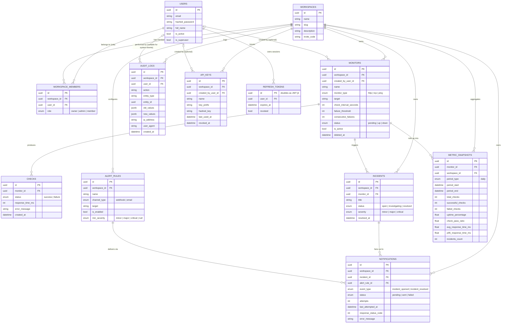

# Database ER Diagram

Sentinel's schema is managed by Alembic (`alembic/versions/`, 9 migrations) and
defined in `app/models/`. Every table uses a UUID primary key
(`UUIDPkMixin`) and `created_at`/`updated_at` timestamps
(`CreatedAtMixin`/`TimestampMixin`).

## Notes on design decisions

- **UUID primary keys everywhere** — avoids leaking sequential IDs across
  workspace boundaries and lets rows be created client-side / merged across
  environments without collision.
- **`workspace_id` on almost every table** — Sentinel is multi-tenant; every
  domain table (monitors, incidents, alert rules, notifications, audit logs,
  API keys, metric snapshots) is scoped to a workspace and every repository
  query filters on it. See [`docs/INTERVIEW_NOTES.md`](INTERVIEW_NOTES.md)
  for the "why multi-tenant" rationale.
- **Soft delete on `monitors`** — `deleted_at` (nullable) instead of a hard
  delete, so historical `checks`/`incidents`/`metric_snapshots` referencing
  a deleted monitor remain intact for audit/analytics. A partial unique index
  (`uq_monitors_workspace_id_monitor_type_target`, `WHERE deleted_at IS
  NULL`) allows re-creating a monitor with the same type+target after the
  original is deleted.
- **`ON DELETE SET NULL` for "created by" / "actor" FKs** (`monitors.
  created_by_user_id`, `api_keys.created_by_user_id`,
  `audit_logs.user_id`) — deleting a user doesn't cascade-delete the
  resources they created or the audit trail of their actions; `user_id`
  becomes `NULL`, and `audit_logs.user_id = NULL` is also used deliberately
  for **system-generated** events (auto incident open/resolve, notification
  delivery worker).
- **`refresh_tokens.id` doubles as the JWT `jti` claim** — revocation is a
  single indexed `UPDATE refresh_tokens SET revoked = true WHERE id = :jti`,
  no separate denylist table for refresh tokens (access tokens use a
  short-TTL Redis denylist instead — see
  [`docs/INTERVIEW_NOTES.md`](INTERVIEW_NOTES.md)).
- **`metric_snapshots` unique on `(monitor_id, period_type, period_start)`**
  — the daily aggregation job is idempotent; re-running it for a day it has
  already processed upserts the existing row instead of duplicating it.
- **Indexes** added in migration `0008` on high-cardinality query paths:
  `checks(created_at)`, `checks(monitor_id, created_at)`,
  `checks(monitor_id, status, created_at)`, `incidents(status)`,
  `incidents(created_at)`, `notifications(status)`,
  `monitors(is_active)`, `monitors(deleted_at)` — these back the dashboard,
  metrics, and notification-dispatch queries.

For full column-level detail, see the SQLAlchemy models in `app/models/` and
the migration history in `alembic/versions/`.
